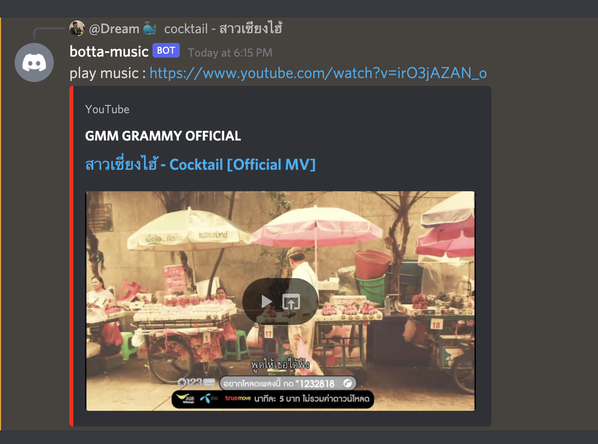

# 🎶 Botta Music (Bot on discord listen youtube music) 🎶🎶


## Screenshot



<br/>
<br/>


### How to run and configuration 

- open index.js and put your api key

```js
const TOKEN = "" // token of bot discord
const CHANNEL_ID = "" // channel id of your discord server
const YT_KEY = "" // youtube data api key for search music
```

- Run command

```js
// Required nodejs v16
> node index.js
```